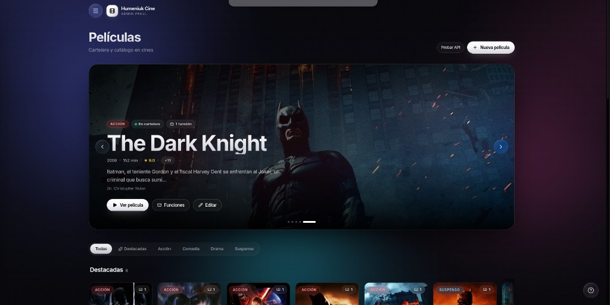
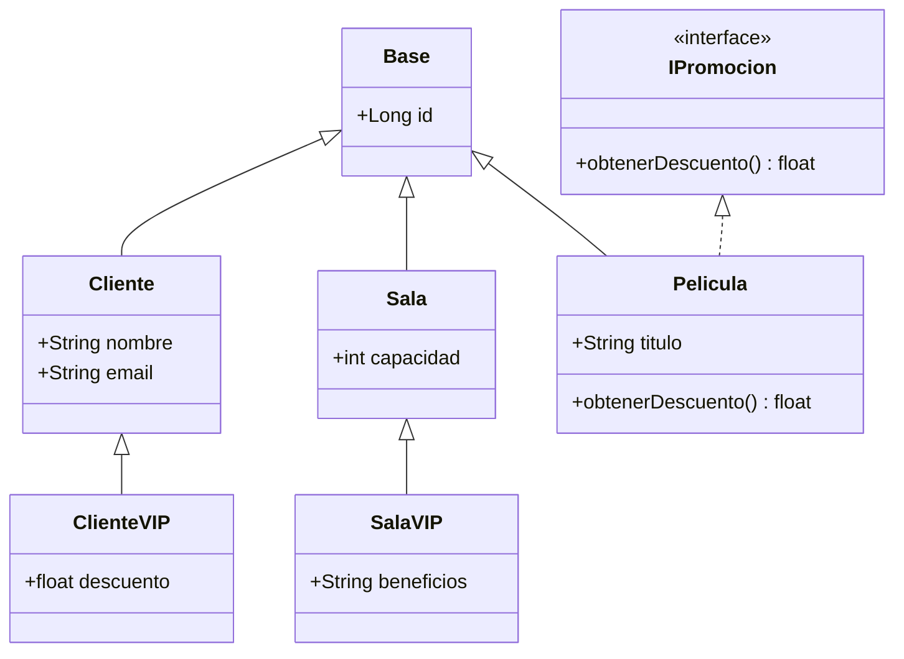
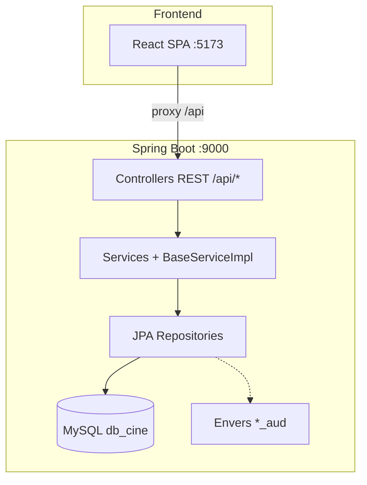

<div align="center">

# Humeniuk Cine

### Sistema de gestión integral para cines

**Proyecto final — Programación Orientada a Objetos**  
*Tecnicatura Universitaria en Desarrollo de Software*

<br/>


<p align="center">
  
  <br />
  <em>Panel de administración — cartelera y catálogo de películas</em>
</p>

</div>

---

## Tabla de contenidos

- [Descripción](#descripción)
- [Objetivos académicos (POO)](#objetivos-académicos-poo)
- [Stack tecnológico](#stack-tecnológico)
- [Arquitectura](#arquitectura)
- [Modelo de dominio](#modelo-de-dominio)
- [API REST](#api-rest)
- [Auditoría con Hibernate Envers](#auditoría-con-hibernate-envers)
- [Requisitos previos](#requisitos-previos)
- [Configuración de la base de datos](#configuración-de-la-base-de-datos)
- [Puesta en marcha del backend](#puesta-en-marcha-del-backend)
- [Puesta en marcha del frontend](#puesta-en-marcha-del-frontend)
- [Datos de demostración (seed)](#datos-de-demostración-seed)
- [Estructura del repositorio](#estructura-del-repositorio)
- [Pruebas de la API](#pruebas-de-la-api)
- [Despliegue integrado (opcional)](#despliegue-integrado-opcional)
- [Solución de problemas](#solución-de-problemas)
- [Licencia y uso académico](#licencia-y-uso-académico)

---

## Descripción

**Humeniuk Cine** es una aplicación full stack para administrar la operación de uno o más complejos cinematográficos: catálogo de películas, salas (estándar y VIP), funciones, venta de entradas, clientes, empleados, compras de insumos a proveedores y registro de pagos.

El **núcleo del proyecto** está desarrollado con **Spring Boot**, aplicando patrones de capas, persistencia JPA, API REST genérica reutilizable y auditoría histórica de entidades. El frontend es un panel de administración en **React + Vite** que consume la API y ofrece CRUD visual para todos los recursos.

| Componente | Rol |
|------------|-----|
| **Backend** (`src/main/java`) | Lógica de negocio, persistencia, endpoints REST, seed de datos |
| **Frontend** (`frontend/`) | SPA de administración con UI dark/gold |
| **MySQL** (`db_cine`) | Persistencia relacional |
| **Seed SQL** (`src/main/resources/db/`) | Datos ficticios de demostración |

---

## Objetivos académicos (POO)

El sistema materializa conceptos centrales de **Programación Orientada a Objetos** dentro del ecosistema Spring:

| Concepto | Implementación en el proyecto |
|----------|------------------------------|
| **Herencia** | `Cliente` → `ClienteVIP`; `Sala` → `SalaVIP`; todas las entidades extienden `Base` |
| **Polimorfismo** | Estrategia `JOINED` en JPA; servicios y controladores parametrizados por tipo |
| **Encapsulamiento** | Entidades JPA con Lombok; lógica en capa `services`, no en controladores |
| **Abstracción** | Interfaces `BaseService`, `BaseController`, `IPromocion`; clases abstractas `BaseServiceImpl`, `BaseControllerImpl` |
| **Interfaces** | `IPromocion` con `obtenerDescuento()` implementada por `Pelicula` |
| **Composición / asociaciones** | `Venta` ↔ `Pago`, `Funcion`, `Cliente`; `Compra` ↔ `Insumo`, `Proveedor` |
| **Enumeraciones** | `Genero`, `TipoPago` |
| **Patrón genérico (templates)** | CRUD reutilizable: un controlador/servicio base sirve a 14 recursos distintos |

### Jerarquía de clases (simplificada)



### Capas Spring (énfasis backend)



---

## Stack tecnológico

### Backend (Spring Boot)

| Tecnología | Versión / detalle |
|------------|-------------------|
| **Spring Boot** | 4.0.6 |
| **Java** | 17 (toolchain Gradle) |
| **Spring Web MVC** | API REST JSON |
| **Spring Data JPA** | Repositorios y `Pageable` |
| **Hibernate ORM** | Mapeo entidad–relacional |
| **Hibernate Envers** | 7.2.12.Final (auditoría; alineado con Hibernate de Boot) |
| **MySQL Connector/J** | Driver JDBC |
| **Lombok** | Reducción de boilerplate en entidades |
| **Spring DevTools** | Recarga en desarrollo |
| **Gradle** | 9.4.1 (wrapper incluido) |

### Frontend

| Tecnología | Versión / detalle |
|------------|-------------------|
| **React** | 19 |
| **TypeScript** | ~6 |
| **Vite** | 8 |
| **Tailwind CSS** | 4 |
| **TanStack React Query** | Cache y fetching |
| **React Router** | 7 |
| **React Hook Form** | Formularios CRUD |
| **Lucide React** | Iconografía |

### Base de datos

- **Motor:** MySQL 8+ (o compatible)
- **Base:** `db_cine`
- **DDL:** `spring.jpa.hibernate.ddl-auto=update` (esquema generado/actualizado por Hibernate al arrancar)

---

## Arquitectura

El backend sigue una **arquitectura en capas** clásica de Spring:

```
com.example.HumeniukCineSpring
├── controllers/     → REST (@RestController), heredan BaseControllerImpl
├── services/        → Contratos + impl (BaseServiceImpl)
├── repositories/    → Spring Data JPA (BaseRepository)
├── entities/        → Modelo de dominio (@Entity)
├── config/          → DatabaseSeeder, CustomRevisionListener (Envers)
└── HumeniukCineSpringApplication.java
```

**Flujo de una petición HTTP:**

1. El cliente llama a `GET/POST/PUT/DELETE /api/{recurso}`.
2. El controlador concreto (p. ej. `PeliculaController`) delega en `BaseControllerImpl`.
3. El servicio (`PeliculaServiceImpl`) ejecuta la transacción vía `PeliculaRepository`.
4. Hibernate persiste o consulta MySQL; Envers registra cambios en tablas `*_aud` cuando la entidad está anotada con `@Audited`.

CORS está habilitado en la capa base de controladores (`@CrossOrigin(origins = "*")`) para permitir el desarrollo con el frontend en otro puerto.

---

## Modelo de dominio

### Entidades principales

| Entidad | Descripción |
|---------|-------------|
| `Cine` | Complejo cinematográfico |
| `Pelicula` | Catálogo (género, director, clasificación, etc.) |
| `Sala` / `SalaVIP` | Salas con herencia JOINED; VIP agrega beneficios |
| `Funcion` | Proyección: película + sala + horario |
| `Entrada` | Ticket asociado a una función |
| `Cliente` / `ClienteVIP` | Compradores; VIP con descuento adicional |
| `Venta` | Operación de venta (cine, pago, funciones, clientes) |
| `Pago` | Medio y monto (`TipoPago`) |
| `Empleado` | Personal del cine |
| `Compra` | Adquisición de insumos |
| `Insumo` | Productos de cantina / operación |
| `Proveedor` | Proveedores de insumos |

### Relaciones destacadas

- **Venta** — `@ManyToOne` con `Cine`; `@OneToOne` con `Pago`; `@ManyToMany` con `Funcion` y `Cliente`.
- **Funcion** — une `Pelicula`, `Sala` y fecha/hora de exhibición.
- **Herencia JOINED** — tablas hijas `cliente_vip` y `sala_vip` con FK a la tabla padre.

---

## API REST

Todos los recursos exponen el **mismo contrato CRUD** heredado de `BaseControllerImpl`:

| Método | Ruta | Descripción |
|--------|------|-------------|
| `GET` | `/api/{recurso}` | Listado completo |
| `GET` | `/api/{recurso}/page?page=&size=&sort=` | Listado paginado (Spring `Pageable`) |
| `GET` | `/api/{recurso}/{id}` | Detalle por ID |
| `POST` | `/api/{recurso}` | Alta (body JSON) |
| `PUT` | `/api/{recurso}/{id}` | Actualización |
| `DELETE` | `/api/{recurso}/{id}` | Baja (respuesta `204`) |

### Recursos disponibles (`{recurso}`)

| Recurso | Base path |
|---------|-----------|
| Cines | `/api/cines` |
| Películas | `/api/peliculas` |
| Salas | `/api/salas` |
| Salas VIP | `/api/salas-vip` |
| Funciones | `/api/funciones` |
| Entradas | `/api/entradas` |
| Clientes | `/api/clientes` |
| Clientes VIP | `/api/clientes-vip` |
| Empleados | `/api/empleados` |
| Ventas | `/api/ventas` |
| Compras | `/api/compras` |
| Pagos | `/api/pagos` |
| Insumos | `/api/insumos` |
| Proveedores | `/api/proveedores` |

**URL base del backend:** `http://localhost:9000`

**Ejemplo:**

```bash
curl -s http://localhost:9000/api/peliculas | head -c 500
curl -s "http://localhost:9000/api/peliculas/page?page=0&size=5&sort=titulo,asc"
```

---

## Auditoría con Hibernate Envers

Las entidades marcadas con `@Audited` generan tablas de historial con sufijo `_aud` y una tabla de revisiones (`REVINFO` / entidad `AuditRevision`).

- Permite consultar **versiones anteriores** de registros críticos (ventas, clientes, funciones, etc.).
- La versión de Envers debe coincidir con la de Hibernate incluida en Spring Boot (**7.2.x**); una versión incompatible provoca errores al persistir.

Si el esquema de auditoría queda inconsistente tras cambios de entidades, con la **aplicación detenida** puede ejecutarse:

```bash
mysql -u TU_USUARIO -p db_cine < scripts/fix-envers-mysql.sql
```

Luego reiniciar la app para que Hibernate regenere las tablas `_aud`.

---

## Requisitos previos

| Herramienta | Versión mínima recomendada |
|-------------|----------------------------|
| **JDK** | 17 |
| **Gradle** | Usar `./gradlew` del proyecto (no requiere instalación global) |
| **MySQL Server** | 8.0+ |
| **Node.js** | 18+ (frontend) |
| **npm** | 9+ |

Comprobar versiones:

```bash
java -version
./gradlew --version
node -v && npm -v
mysql --version
```

---

## Configuración de la base de datos

### 1. Crear la base y el usuario

```sql
CREATE DATABASE IF NOT EXISTS db_cine
  CHARACTER SET utf8mb4
  COLLATE utf8mb4_unicode_ci;

CREATE USER IF NOT EXISTS 'jota'@'localhost' IDENTIFIED BY 'password123';
GRANT ALL PRIVILEGES ON db_cine.* TO 'jota'@'localhost';
FLUSH PRIVILEGES;
```

> Ajustá usuario y contraseña según tu entorno local.

### 2. Configurar `application.properties`

Editar `src/main/resources/application.properties`:

```properties
spring.datasource.url=jdbc:mysql://localhost:3306/db_cine?serverTimezone=UTC&useSSL=false&allowPublicKeyRetrieval=true
spring.datasource.username=TU_USUARIO
spring.datasource.password=TU_PASSWORD

server.port=9000
app.seed.enabled=true
```

| Propiedad | Descripción |
|-----------|-------------|
| `spring.jpa.hibernate.ddl-auto=update` | Crea/actualiza tablas al iniciar |
| `spring.jpa.show-sql=true` | Muestra SQL en consola (útil en desarrollo) |
| `app.seed.enabled=true` | Carga datos demo si `pelicula` está vacía |

---

## Puesta en marcha del backend

Desde la **raíz del repositorio**:

```bash
# Compilar y ejecutar (puerto 9000)
./gradlew bootRun
```

Otros comandos útiles:

```bash
./gradlew build          # Compilar y ejecutar tests
./gradlew test           # Solo tests
./gradlew bootJar        # JAR ejecutable en build/libs/
```

Tras el arranque exitoso:

- API disponible en **http://localhost:9000**
- Si la base está vacía, `DatabaseSeeder` ejecuta `db/seed-db-cine.sql` automáticamente (películas de franquicias conocidas, cines, funciones, ventas de ejemplo, etc.)

---

## Puesta en marcha del frontend

En una **segunda terminal**, con el backend ya en ejecución:

```bash
cd frontend
npm install
npm run dev
```

Abrir **http://localhost:5173**

El proxy de Vite reenvía las peticiones `/api/*` al backend en el puerto 9000 (`frontend/vite.config.ts`).

### Scripts npm

| Comando | Descripción |
|---------|-------------|
| `npm run dev` | Servidor de desarrollo |
| `npm run build` | Build de producción en `frontend/dist/` |
| `npm run preview` | Vista previa del build |
| `npm run lint` | ESLint |
| `npm run media:download` | Descarga portadas TMDB a `public/media/` (requiere red, opcional) |

### Secciones del panel

| Ruta | Contenido |
|------|-----------|
| `/` | Cartelera / películas |
| `/dashboard` | Resumen operativo |
| `/cines`, `/peliculas`, `/salas`, `/funciones` | Gestión de exhibición |
| `/clientes`, `/ventas`, `/compras` | Comercial |
| `/empleados`, `/entradas`, `/pagos`, `/insumos`, `/proveedores` | Operaciones y stock |
| `/api-explorer` | Probador manual de los 14 endpoints |

Documentación adicional del frontend: [`frontend/README.md`](frontend/README.md).

---

## Datos de demostración (seed)

- **Archivo:** `src/main/resources/db/seed-db-cine.sql`
- **Disparador:** componente `DatabaseSeeder` al evento `ApplicationReadyEvent`
- **Condición:** solo si `SELECT COUNT(*) FROM pelicula` es `0` y `app.seed.enabled=true`

El seed incluye, entre otros:

- Películas con metadatos reales (Star Wars, Batman, Marvel, etc.)
- Cines, salas (incl. VIP), funciones programadas
- Clientes, ventas, compras e insumos de ejemplo

Para **forzar una recarga** en desarrollo: vaciar tablas o eliminar la base y reiniciar la aplicación.

---

## Estructura del repositorio

```
HumeniukCineSpring/
├── build.gradle                 # Dependencias Spring Boot + Envers
├── gradlew / gradlew.bat        # Wrapper Gradle
├── src/main/java/.../           # Código backend
│   ├── controllers/             # 14 REST controllers
│   ├── services/                # Lógica de negocio
│   ├── repositories/            # JPA
│   ├── entities/                # Dominio + Envers
│   └── config/                  # Seeder, auditoría
├── src/main/resources/
│   ├── application.properties
│   └── db/seed-db-cine.sql
├── scripts/fix-envers-mysql.sql
└── frontend/                    # SPA React
    ├── src/
    │   ├── api/client.ts        # Cliente HTTP + recursos
    │   ├── pages/               # Pantallas CRUD
    │   └── components/
    ├── public/media/            # Portadas locales
    └── package.json
```

---

## Pruebas de la API

### Desde el frontend

Cada pantalla de recurso permite probar **GET, GET /page, GET /{id}, POST, PUT y DELETE** desde la UI. El **Explorador API** (`/api-explorer`) acepta bodies JSON editables manualmente.

### Desde línea de comandos

```bash
# Listar películas
curl -s http://localhost:9000/api/peliculas

# Crear una película (ejemplo mínimo)
curl -s -X POST http://localhost:9000/api/peliculas \
  -H "Content-Type: application/json" \
  -d '{"titulo":"Ejemplo","genero":"ACCION","puntaje":8.0,"anio":2024,"duracionMinutos":120,"director":"Director","clasificacion":"ATP"}'

# Paginación
curl -s "http://localhost:9000/api/peliculas/page?page=0&size=10&sort=titulo,asc"
```

### Tests automatizados (backend)

```bash
./gradlew test
```

---

## Despliegue integrado (opcional)

Para servir el frontend **desde el mismo puerto** que Spring Boot:

```bash
cd frontend
npm run build
cp -r dist/* ../src/main/resources/static/
./gradlew bootRun
```

La aplicación quedará accesible en `http://localhost:9000` con la SPA y la API en el mismo origen.

---

## Solución de problemas

| Síntoma | Posible causa | Acción |
|---------|---------------|--------|
| Error de conexión JDBC | MySQL apagado o credenciales incorrectas | Verificar servicio y `application.properties` |
| `Access denied for user` | Usuario sin permisos en `db_cine` | Revisar `GRANT` en MySQL |
| Seed no se ejecuta | Ya hay filas en `pelicula` | Truncar tablas o `app.seed.enabled=false` |
| `NoSuchMethodError` al guardar `@Audited` | Versión Envers incompatible | Usar `hibernate-envers:7.2.12.Final` como en `build.gradle` |
| Tablas `_aud` corruptas | Cambios de esquema Envers | Ejecutar `scripts/fix-envers-mysql.sql` con la app detenida |
| Frontend sin datos | Backend no levantado en :9000 | `./gradlew bootRun` antes de `npm run dev` |
| Imágenes sin cargar | Falta `public/media/` | `npm run media:download` o commitear media en el repo |
| CORS en producción | Origen distinto al configurado | Restringir `@CrossOrigin` al dominio real |

---

## Licencia y uso académico

Proyecto desarrollado con fines **educativos** para la materia **Programación Orientada a Objetos** de la **Tecnicatura Universitaria en Desarrollo de Software**.

El código, los datos de seed (títulos de películas, metadatos públicos) y las imágenes de cartelera utilizadas en el frontend son propiedad de sus respectivos titulares; su uso en este trabajo es con carácter demostrativo y no comercial.

---

<div align="center">

**Humeniuk Cine** — Gestión cinematográfica con Spring Boot y POO

*Backend first · API REST · JPA · Envers · React admin panel*

</div>
